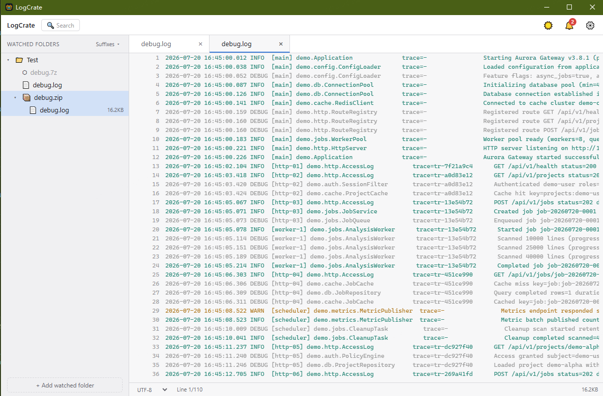
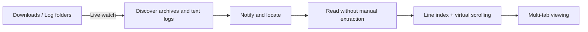

<p align="center">
  <strong>English</strong> · <a href="./README_ZH.md">简体中文</a>
</p>

<p align="center">
  
</p>

<h1 align="center">LogCrate</h1>

<p align="center">
  <strong>Watch folders. Catch new logs. Skip extraction. Start reading.</strong>
</p>

<p align="center">
  A lightweight desktop log viewer for Windows and macOS.<br>
  Turn “download archive → extract → hunt for logs → open files” into one click.
</p>

<p align="center">
  <a href="https://github.com/Strive-Sun/LogCrate/releases/latest"></a>
  <a href="https://github.com/Strive-Sun/LogCrate/actions/workflows/ci.yml"></a>
  
  
  <a href="LICENSE"></a>
</p>

<p align="center">
  <a href="https://github.com/Strive-Sun/LogCrate/releases/latest"><strong>Download the latest release</strong></a>
  · <a href="CHANGELOG.md">Changelog</a>
  · <a href="docs/technical-design.md">Technical design</a>
</p>

<p align="center">
  <picture>
    <source
      media="(prefers-color-scheme: dark)"
      srcset="resources/screenshots/logcrate-hero-dark.png"
    >
    <source
      media="(prefers-color-scheme: light)"
      srcset="resources/screenshots/logcrate-hero-light.png"
    >
    
  </picture>
</p>

---

## Why LogCrate

Production debugging often starts with a ZIP file: download it, extract it, dig through nested folders for `.log` or `.txt` files, then open them one by one. The larger the files and the more archives you receive, the more this repetitive workflow interrupts the investigation.

LogCrate is built around that exact path:



- **Discover logs as they arrive** — recursively watch directories and notify even when new logs land deep inside unopened subfolders.
- **Read archives directly** — browse ZIP, 7z, RAR, TAR and compressed streams like folders without creating a scattered manual extraction directory.
- **Expand nested archives lazily** — recognize archive entries inside another archive and read the next layer only when you expand it.
- **Open large logs** — build line indexes in the background and load only the visible range instead of putting a multi-gigabyte file into memory.
- **Find files and important lines quickly** — search local file names and paths, use `Ctrl+F` inside a log, or filter recognized time, level, discrete, and text fields.
- **Keep investigation context** — each tab retains its own scroll position, encoding, and loaded content.
- **Resume where you stopped** — restore tabs and layouts after restart, and react safely when a source changes or disappears.
- **Local-first processing** — logs stay on your machine; no cloud upload service is required.

## Highlights

| Capability                       | What it does                                                                                                               |
| -------------------------------- | -------------------------------------------------------------------------------------------------------------------------- |
| Live directory monitoring        | Reflects external create, delete, rename, and modify operations; discovers new logs at any directory depth                 |
| Archives without manual extraction | Reads ZIP, 7z, RAR4/RAR5, TAR, tar.gz/bz2/xz/zst and single-file compressed streams directly                              |
| Plain log viewing                | Reads `.log`, `.txt`, `.out`, `.err`, `.trace`, `.json`, `.csv`, and other recognized text files                           |
| Drag and start                   | Dropping one file watches its parent; dropping a folder watches that folder; dropping a text log also opens and locates it |
| Multi-file tabs                  | Deduplicates repeated opens, moves overflow into a More menu, and preserves per-file reading state                         |
| Virtual scrolling for large logs | Uses line-offset indexing, windowed reads, and bounded caches so memory usage does not scale with the full file            |
| Encoding support                 | Detects UTF-8, GBK / GB18030, UTF-16LE / UTF-16BE, with manual override                                                    |
| In-log find and highlighting     | Uses `Ctrl+F` for forward/reverse, whole-word, case-sensitive, wrapping navigation and visible match highlighting           |
| Adaptive field filtering         | Recognizes common log layouts and filters time ranges, levels, discrete values, and text with editable, reusable layouts   |
| Local file search                | Optionally indexes file names and paths across local volumes, supports fast queries, log preview, and adding result folders |
| Workspace restoration            | Restores tabs, active file, ordering, encoding and saved field layouts, while handling changed or missing sources safely    |
| New-log notifications            | Shows an unread badge, locates individual arrivals, and supports marking everything as read                                |
| Suffix filtering                 | Controls which file extensions appear and trigger notifications, with an option to show everything                         |
| Signed automatic updates         | Supports startup/manual checks, progress, signature verification and install; Windows prefers the Pages mirror with GitHub fallback |
| Desktop behavior                 | Includes three UI templates, light/dark themes, single-instance restore, close-to-tray, auto-hiding scrollbars, and a resizable directory pane |
| UI languages                     | Follows the system by default and switches instantly between English and Simplified Chinese in Settings                    |

> LogCrate is currently a **read-only viewer**. It can rename or delete files on disk, but it cannot edit log content or create, modify, or repack archives.

## Get started in 5 minutes

### 1. Install

Open [GitHub Releases](https://github.com/Strive-Sun/LogCrate/releases/latest) and download the installer for your system:

- **Windows** — prefer `setup.exe`; an `.msi` package is also available.
- **macOS** — download the `.dmg`; releases are built as universal binaries.

LogCrate uses the system WebView. Windows 10 and 11 usually include WebView2 already; if it is missing, Windows will prompt you to install it.

### 2. Add a watched folder

On first launch, click **“+ Add watched folder”** at the bottom of the left sidebar. Good candidates include:

- your browser Downloads folder;
- a chat application's received-files folder;
- a test-device export directory;
- a local service log directory.

LogCrate persists watched folders and restores them on the next launch. Watch roots are normalized by parent-child coverage, so a child is not watched twice after its parent has been added.

### 3. Open a log

Start reading in any of these ways:

1. Click a plain log file in the directory tree.
2. Expand an archive, then expand nested archives as needed and click a log entry.
3. Drag a log, archive, or folder from the file manager into LogCrate.

When you drop a text log, LogCrate adds its parent folder, expands the tree, locates the file, and opens it. Dropping an archive or another file adds its containing folder to monitoring. Dropping a folder watches that folder itself.

> One dropped path is handled at a time today. Multi-file drag and drop is on the roadmap.

### 4. View multiple files

Click more logs to create tabs:

- opening the same file again activates its existing tab instead of creating a duplicate;
- tabs that no longer fit move into the **More** menu;
- choosing a file from More swaps it into the visible tab strip;
- hovering a tab name shows the full absolute path;
- clicking `×` releases that tab's viewing session.

The backend keeps a bounded number of active sessions. An older tab may become dormant; clicking it transparently rebuilds its index and restores the selected encoding.

### 5. Find and filter log content

- Press `Ctrl+F` in the active log to search forward or backward, match whole words, respect case, and optionally wrap at the end.
- For recognized layouts, use the field bar to filter by minute-precision time range, level/discrete values, or text content.
- Choose **matching rows only** or **highlight matches**; optionally keep unparsed rows visible.
- Drag field boundaries or rename, split, merge, and retype fields. Confirmed layouts are restored for the same source later.

### 6. Fix encoding and filter files

- **Garbled text** — use the encoding selector at the bottom-left of the content pane to choose UTF-8, GBK, GB18030, or UTF-16.
- **Too many files** — use the suffix filter beside “Watched folders” to keep only the extensions you care about.
- **Need another file temporarily** — enable “Show all”; a currently open file remains visible even if it no longer matches the filter.

### 7. Search local files (optional)

Enable **Search local files** in Settings and restart LogCrate. The Search entry can then query indexed file names and paths across available volumes. Double-click a log result to open it, or add its containing folder to monitoring from the context menu.

On Windows, LogCrate uses a bounded index service for fast MFT/USN discovery and incremental recovery. Search is disabled by default and its index runtime is not initialized when the feature is off.

### 8. Handle newly arrived logs

When a new supported archive or matching log appears under a watched folder, the bell in the top-right shows an unread count. Clicking a notification expands the directory chain and locates the target. “Mark all as read” clears notifications only; it never deletes files.

## Common tasks

| I want to…                             | Action                                  | Result                                                                |
| -------------------------------------- | --------------------------------------- | --------------------------------------------------------------------- |
| Watch another folder                   | Click “+ Add watched folder”            | Saves the folder and starts recursive monitoring immediately          |
| Inspect a local log quickly            | Drop one log into the window            | Adds its parent, locates the file, and opens it                       |
| Watch a whole folder                   | Drop the folder into the window         | Adds that folder as a watch root                                      |
| Read a log inside an archive           | Expand each required layer and click a log | Lazily opens nested archives without manual extraction             |
| Distinguish same-named files           | Hover a tab                             | Shows the absolute disk path and archive entry path                   |
| Change text encoding                   | Use the encoding menu below the content | Rebuilds the line index in the background                             |
| Find text in the active log            | Press `Ctrl+F`                          | Navigates and highlights matching keyword fragments                   |
| Filter structured fields               | Use controls above the log content      | Filters or highlights rows by time, level, discrete value, or text    |
| Search local file names and paths       | Enable Search in Settings, restart, then use the top Search entry | Queries the local metadata index without uploading content |
| Locate a path in the file manager      | Right-click a file or folder            | Opens the system file manager at that path                            |
| Stop watching but keep files           | Right-click a watch root → Remove watch | Removes monitoring without changing disk content                      |
| Delete a file or directory             | Right-click → Delete, then confirm      | Moves it to the system recycle bin instead of permanently deleting it |
| Keep LogCrate running in the background | Click the window close button          | Hides to the tray while monitoring continues                          |
| Exit completely                         | Tray menu → Exit LogCrate              | Stops monitoring and terminates the process                           |
| Check for a new release                | Settings → Check for updates            | Downloads, verifies, and installs an official release                 |

## Support matrix

### Supported today

- **Operating systems** — 64-bit Windows; Intel and Apple Silicon macOS.
- **Archives** — ZIP, 7z, single-volume RAR4/RAR5, TAR, tar.gz/tgz, tar.bz2/tbz/tbz2, tar.xz/txz, and tar.zst/tzst.
- **Single-file streams** — gzip, bzip2, xz, and zstd synthesize one directly readable log entry.
- **Nested archives** — any supported format can contain another; each next layer is read only after you explicitly expand it (maximum depth: 5).
- **Text** — common log extensions plus files recognized as text through content sampling.
- **Encodings** — UTF-8, GBK, GB18030, UTF-16LE, and UTF-16BE.
- **Interface languages** — English and Simplified Chinese, with a persisted system/manual preference.
- **Log layouts** — bracketed application logs, Chromium/CEF-style logs, and Android logcat can be recognized automatically; other layouts fall back to an editable body field.
- **Local search** — optional persistent file-name/path indexing, with fast Windows NTFS MFT/USN discovery and cross-platform fallback providers.

### Current boundaries

- Read-only preview; source files are never edited. A cached snapshot may be exported after its source is deleted.
- One path per drag-and-drop operation.
- No archive creation, modification, entry deletion, or repacking.
- Password-protected and multi-volume 7z/RAR archives are detected but not opened yet.
- WIM disk-image containers are not supported. WIM support requires separate native-dependency and cross-platform packaging work.
- Local file search is opt-in and applies after restart; file contents remain local and are not uploaded.
- Windows automatic updates prefer the Cloudflare Pages mirror for the signed NSIS package and fall back to GitHub; MSI and macOS packages remain on GitHub.

## Roadmap

The roadmap describes direction, not a promised version or delivery date. Issues are welcome when discussing priorities.

### Near term: make investigation loops faster

- [ ] **Regular-expression search and result overview** — extend current keyword navigation with regex, total counts, and a compact result list.
- [ ] **Multi-file drag and drop** — accept several logs or folders at once and report the result of each item.
- [ ] **Follow appended content** — provide a `tail -f`-style follow mode for plain logs that are still being written.
- [ ] **Bookmarks and line annotations** — save important lines and local notes, then recover their location when possible after a file changes.

### Mid term: side-by-side investigation

- [ ] **Side-by-side log panes** — display two logs next to each other with independent or synchronized scrolling.
- [ ] **Log comparison** — align by line, time, or key fields and highlight additions, omissions, and changes.
- [ ] **Cross-file timeline** — correlate selected logs by timestamp while preserving each file's original lines and context.

### Long term: more formats and stronger workflows

- [ ] **Structured JSON log views** — expand JSON Lines fields, select columns, and build reusable conditions beyond current text-layout filtering.
- [ ] **Search indexes for huge logs** — accelerate repeated queries without loading the complete file into memory.
- [ ] **Export investigation snippets** — export the smallest useful range by selected lines or time window for issues and team sharing.
- [ ] **Reusable rule sets** — save combinations of levels, keywords, colors, and suffixes, then switch between projects quickly.
- [ ] **AI-assisted log analysis** — summarize explicitly selected log ranges, identify abnormal patterns, and suggest likely causes and investigation steps, with configurable local or remote models and clear redaction controls before any content is sent.

## How it works

LogCrate is built with Tauri 2. The frontend owns interaction and virtualized lists; the Rust backend owns file watching, archive access, encoding detection, line/field indexing, and local file search.

| Layer              | Responsibility                                                                                         |
| ------------------ | ------------------------------------------------------------------------------------------------------ |
| React + TypeScript | Directory tree, notifications, tabs, settings, field filters, search UI, and the virtualized log view   |
| Tauri IPC          | Commands and progress events between the UI and local Rust capabilities                                |
| Rust watcher       | Recursive directory monitoring, event coalescing, file stability checks, and configuration persistence |
| ArchiveReader      | Bounded streaming access for ZIP, 7z, RAR, TAR, compressed streams, nested archives, and plain text     |
| SessionManager     | Encoding detection, line/field indexes, windowed filtering, bounded-session LRU, and temporary-resource cleanup |
| SearchManager      | Persistent SQLite/Tantivy metadata index, bounded multi-volume scheduling, queries, and recovery       |
| Windows index service | Privileged MFT/USN discovery through a bounded local IPC protocol; repairable from Settings         |

Read the [technical design](docs/technical-design.md) for implementation detail and [CHANGELOG.md](CHANGELOG.md) for version history.

## Local development

### Prerequisites

- [Node.js](https://nodejs.org/) 22 or the current LTS release;
- [Rust](https://rustup.rs/) and Cargo;
- on Windows, the Visual Studio “Desktop development with C++” workload;
- the platform dependencies listed in [Tauri Prerequisites](https://v2.tauri.app/start/prerequisites/).

### Run the desktop app

```bash
npm install
npm run tauri:dev
```

The first run compiles the Tauri and Rust dependency tree. Later runs use incremental compilation.

### Work on the frontend only

```bash
npm run dev
```

Open `http://localhost:1420`. In a browser, the frontend automatically uses built-in mock data, so the Rust backend is not required.

### Quality checks

```bash
npm run format:check
npm test
npm run lint
npm run build
cargo test --manifest-path src-tauri/Cargo.toml
```

### Build installers

```bash
npm run tauri:build
```

Artifacts are written to `src-tauri/target/release/bundle/`. Official releases are built and signed by GitHub Actions on Windows and macOS.

## Repository layout

```text
logcrate/
├── src/                  # React + TypeScript frontend
│   ├── api/              # Tauri / mock API adapters
│   ├── components/       # Directory tree, tabs, log view, settings, and dialogs
│   └── util/             # Pure state helpers and frontend unit tests
├── src-tauri/            # Rust + Tauri backend
│   └── src/
│       ├── archive/      # Archive registry, format readers, nested streams, and plain text
│       ├── index.rs      # Line/field indexes, encodings, filters, caches, and session lifecycle
│       ├── search.rs     # Local search orchestration, persistence, recovery, and platform providers
│       ├── search_index.rs # Tantivy query index and snapshot switching
│       ├── ntfs/         # Windows MFT/USN parsing and bounded service IPC
│       ├── watcher.rs    # Directory monitoring, stability checks, and persisted configuration
│       └── lib.rs        # Tauri commands, events, tray, and application lifecycle
├── openspec/             # Capability specs, change proposals, and archives
├── docs/                 # Technical design and development workflow
└── .github/workflows/    # CI and cross-platform releases
```

## Contributing

Issues, feature proposals, and pull requests are welcome. When reporting a problem, please include:

- the LogCrate version and operating system;
- whether the log is a plain file or an entry inside a possibly nested archive;
- the file size, encoding, and reproduction steps;
- a screenshot for UI issues, after removing sensitive log content and local paths.

New capabilities are specified through OpenSpec before implementation. See [docs/dev-workflow.md](docs/dev-workflow.md) for the development and release workflow.

## License

LogCrate is free software released under the [GNU General Public License v3.0](LICENSE) (`GPL-3.0-only`).

Bundled third-party components retain their own terms and attribution. See [`resources/licenses/`](resources/licenses/), including the Orange search-module attribution and the UnRAR restriction notice.
